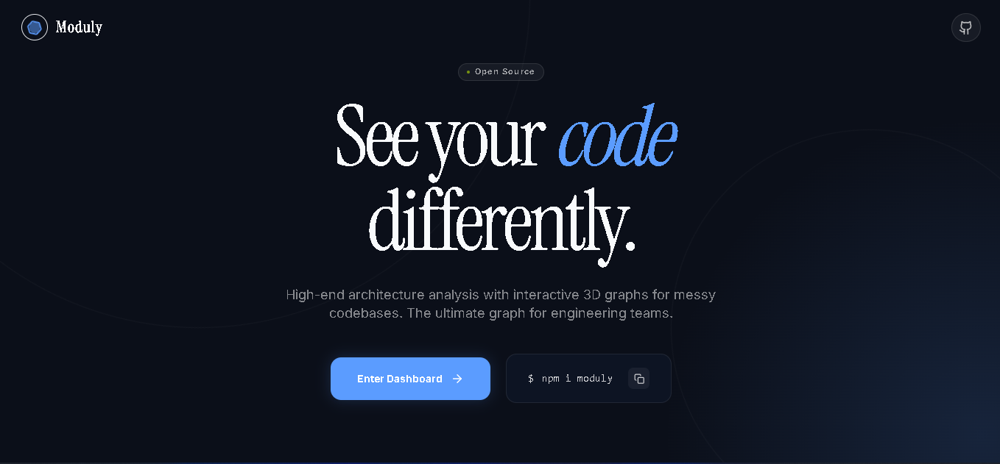

# 🪐 Moduly Frontend

> The official landing page and 3D architectural dashboard for **Moduly** — the intelligent codebase analysis tool.



Moduly transforms messy directory structures into intuitive, navigable 3D graph networks. It parses your project files locally, tracking dependencies, architecture scaling, and calculating modularity scores instantly.

This repository exclusively holds the **Moduly Frontend**, a modern Next.js 14 application that serves two primary purposes:
1. An incredibly sleek, interactive landing page introducing the core concepts behind the Moduly ecosystem.
2. The dynamic 3D WebGL dashboard mapping codebases on the fly natively from outputs generated by the [Moduly CLI](../Moduly-cli).

---

## 🚀 Key Features

*   **Interactive Landing UI:** A dynamic presentation built with `framer-motion`, including automated live-typing moduly terminals and visual codebase organizing sequences.
*   **3D Codebase Explorer:** Deep integration with `three.js` and `react-force-graph-3d` to render your project's raw AST parsed JSON into an immersive force-directed 3D landscape.
*   **Real-Time Analytics Dashboard:** Syncs beautifully with localized architecture reports providing component health scores, file statistics, circular dependency mappings, and network visualizers.
*   **Modern Stack Architecture:** Built completely utilizing standard web deployment best practices for scale and performance.

---

## 🛠 Tech Stack

*   **Framework:** Next.js 14 (App Router) & React 18
*   **Styling:** Tailwind CSS, `clsx`, and `tailwind-merge`
*   **Animations:** Framer Motion
*   **3D Mapping & Rendering Engine:** Three.js, `@react-three/fiber`, `@react-three/drei`, `react-force-graph-3d`
*   **Icons & Assets:** Lucide React Icons

---

## 📦 Installation & Local Setup

1. **Clone the repository locally:**
   ```bash
   git clone https://github.com/your-username/moduly-frontend.git
   cd moduly-frontend
   ```

2. **Install all dependencies:**
   ```bash
   npm install
   ```

3. **Start the Next development server:**
   ```bash
   npm run dev
   ```

4. **Experience the app:**
   Navigate in your browser to [https://moduly-zeta.vercel.app](https://moduly-zeta.vercel.app) to view the Moduly landing page and dashboard.

---

## 🤖 Interacting with Moduly CLI

The frontend is specifically designed to work seamlessly with the localized output payloads generated by the native Moduly CLI.

1. Install the cli using `npm i -g moduly-cli` in your terminal.
2. Navigate to your target software project codebase and run `moduly analyze --report`.
3. The CLI locally spins up the analysis engine and outputs a `.moduly/report.json` document inside your project directory.
4. The Moduly frontend Dashboard route reads this JSON payload dynamically to render the 3D map!

> **Note:** Because `.moduly` generates architectural maps deeply tied to private local codebase paths, we have configured `.gitignore` to explicitly ignore `.moduly` directory outputs on the frontend. This keeps your github history perfectly clean!

---

## 🎨 Design Philosophy

Moduly employs a sleek, dark aesthetic heavily styled in "Neon Cyber" aesthetics to mimic hacking screens and deep tech scanning environments:
- **Primary Color Axis:** `var(--primary)` natively set to `#CCFF00` (Electric Lime)
- **Background Layering:** `#0f111a`, `#0a0a0a` & frosted glass-morphism panels.
- **Typography Engine:** Utilizes heavy amounts of monospace typefaces mixed tightly with sans-serif variants.

---

## 📝 License

This project is licensed under the MIT License - feel absolutely free to tinker with and evolve the system!
